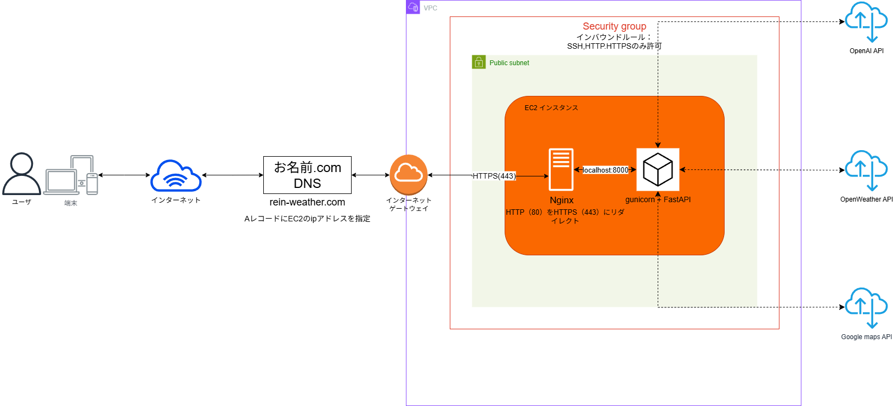

このリポジトリは、クラウドインフラからバックエンド・フロントエンド開発まで一貫して担当したポートフォリオ用プロジェクトです。

# rein-weather（AI × FastAPI）

## 概要
rein-weatherは、AIによる解説と服装アドバイスを提供する天気アプリです。

デモURL：https://rein-weather.com/

## 主な機能
- 現在地の天気取得（気温・湿度・天気アイコン）
- 降水確率グラフ（3時間ごと）
- GPTによる天気解説と服装アドバイス
- 自然文による都市フィルター（例：「涼しい場所を教えて」）
- ダークモード対応 / レスポンシブUI
- 推薦理由キャッシュ（reason_cache.json）
- マップ表示

## 使用技術一覧

  


     

## 技術構成

- **バックエンド**: FastAPI（python）, gunicorn
- **フロントエンド**: HTML, CSS, JavaScript, Chart.js
- **API**:
    - OpenWeatherMap API
    - OpenAI API
    - Google Maps API
- **インフラ**: AWS EC2 (Ubuntu), nginx, Let's Encrypt SSL, systemd
- **CI/CDツール**: GitHub Actions

## 構成図（/docsにソースあり）

以下はrein-weatherのAWS構成図です。EC2にFastAPIとnginx（リバースプロキシサーバー）を配置し、SSL実装まで行いました。


## 開発背景
実務や資格の学習だけではWeb開発からAWS構築まで一貫した経験が得られないと考え、自ら企画・設計・開発・構築を実施しました。その結果、Linuxサーバー構築からAWS EC2の本番運用までを一人で完結させることができました。

**成果**：
- AWS EC2での本番運用（nginx + gunicorn + HTTPS対応）
- OpenAI APIを利用した自動解説文生成機能を実装。
- Linuxサーバー構築、403エラーなどの権限設定のトラブルシュートを実施。サービスを外部公開まで安定稼働させた。
- GitHubを使ったバージョン管理・チーム開発を意識した運用を実施。
- CI/CD導入（GitHub Actionsでmainにマージ→自動的にEC2へ展開）

## AI利用について

最終的な構成・機能設計・AWS構築はすべて自身で行い、  
AIからの提案はコードレビュー・修正を経て採用しています。

AIを補助ツールとして利用しつつ、最終的な設計・実装・運用は自分で行いました。

## ディレクトリ構造

```
.
└── weather-app-clean/
    ├── .github/
    │   └── workflows/
    │       ├── main.yml
    │       └── aws.disabled.yml
    ├── .vscode/
    │   └── settings.json
    ├── data
    ├── data_preprocessing/
    │   ├── convert_city_names_to_ja.py
    │   ├── convert_top20_to_ja.py
    │   ├── enrich_city_data.py
    │   ├── extract_japan_cities.py
    │   ├── generate_city_data.py
    │   └── prepare_city_weather_data_async.py
    ├── docs/
    │   ├── old
    │   ├── img/
    │   │   ├── AWS-architecture_20251001_v1.drawio
    │   │   └── AWS-architecture_20251001_v1.png
    │   └── README.md
    ├── routes/
    │   ├── explanation.py
    │   ├── filter.py
    │   ├── generate_cities.py
    │   ├── geocode.py
    │   ├── nlp_filter.py
    │   ├── view.py
    │   └── weather.py
    ├── static/
    │   ├── old
    │   ├── android-chrome-192x192.png
    │   ├── android-chrome-512x512.png
    │   ├── apple-touch-icon.png
    │   ├── favicon-16x16.png
    │   ├── favicon-32x32.png
    │   ├── favicon.ico
    │   ├── site.webmanifest
    │   └── style-dark.css
    ├── templates/
    │   ├── old
    │   └── index.html
    ├── utils/
    │   ├── config.py
    │   └── openai_client.py
    ├── .gitattributes
    ├── .gitignore
    ├── LICENSE.txt
    ├── main.py
    └── requirements.txt
```

---

## セットアップ方法

### 1. 環境構築

```
git clone https://github.com/<yourname>/rein-weather.git
cd rein-weather
python3 -m venv venv
source venv/bin/activate
pip install -r requirements.txt
```

windowsの場合：
```
venv/scripts/activate
```

### 2. 環境変数設定（.env）
※実際の値は.envファイルに記載、GitHubには公開しないこと

```
OPENWEATHER_API_KEY=xxxxx
OPENAI_API_KEY=xxxxx
GOOGLE_MAPS_API_KEY=xxxxx
```

### 3. ローカル実行

```
uvicorn main:app --reload
```

### 4. AWSデプロイ（簡易手順）

- EC2インスタンス作成（Ubuntu）
- 必要パッケージインストール（Python, nginx, certbot等）
- アプリ配置＆gunicorn + systemd設定
- nginxリバースプロキシ設定
- Let's EncryptでSSL化

---

## トラブルシュート

### 静的ファイル（CSS・favicon）が表示されない場合

- **症状**:

```
GET https://your-domain.com/static/style-dark.css 403 (Forbidden)
GET https://your-domain.com/favicon.ico 403 (Forbidden)
```

- **原因**: `/home/ubuntu` に `www-data` ユーザーが入れない（実行権限不足）
- **解決**:

```
sudo chmod 755 /home/ubuntu
sudo chmod 755 /home/ubuntu/weather-app-clean
sudo chmod 755 /home/ubuntu/weather-app-clean/static
sudo chmod 644 /home/ubuntu/weather-app-clean/static/style-dark.css
sudo chmod 644 /home/ubuntu/weather-app-clean/static/favicon.ico
sudo nginx -t && sudo systemctl reload nginx
```

---

## 今後の改善予定

今後の改善予定としては、今までの手作業を効率化するためのCI/CDパイプラインの導入やIaC（Terraform/Ansible）によるインフラ自動化を検討しています。

- 監視設定の導入（CloudWatch Logs, メトリクス監視）
- TerraformにてEC2をコードとして管理

---

## ライセンス

MIT License
